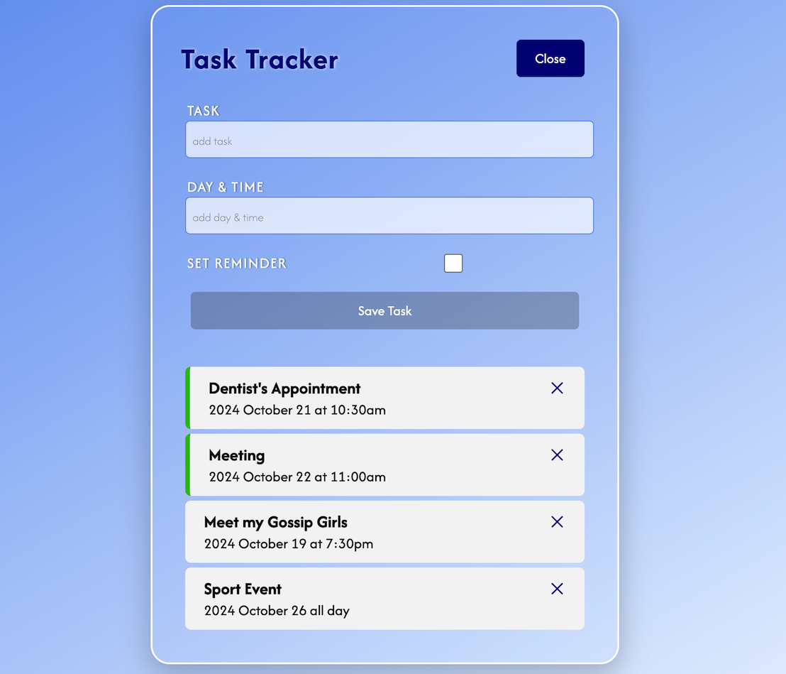

# React Task Tracker

This is a calendar task tracker app built for the sake of familiarization with React. It allows users to add, delete and mark tasks as complete. It illustrates state management, and the use of props and components.


## Installation

1. Clone the repository:
   ```bash
   git clone https://github.com/tpreisig/react-task-tracker.git
   ```
2. Navigate to the project directory:
   ```bash
   cd react-task-tracker
   ```
3. Install dependencies:
   ```bash
   npm install
   ```


## License

This project is licensed under the MIT License - see the [LICENSE](LICENSE) file for details.


## Screenshots




## Contact

Maintained by tpreisig - feel free to reach out!

